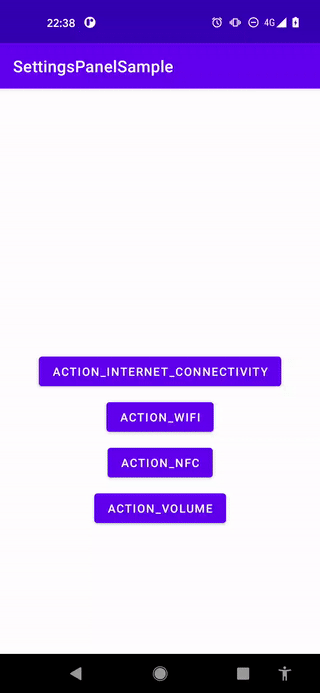

# Overview

sample for Android Settings Panels

[日本語版README](https://github.com/LeoAndo/SettingsPanelSample/blob/main/readme/README_JP.md)

## Feature

Up to Android 9, it was troublesome to start the pre-installed setting application such as Wi-Fi setting, but from Android 10 it became possible to open the setting panel on the application and set some functions. 
[link1](https://developer.android.com/about/versions/10/highlights#settings_panels)
[link2](https://developer.android.com/about/versions/10/features#settings-panels)
[link3](https://developer.android.com/reference/android/provider/Settings.Panel)

From Android 10, by [WifiManager#setWifiEnabled](https://developer.android.com/reference/android/net/wifi/WifiManager#setWifiEnabled(boolean))
Since Wi-FI setting is prohibited, use the setting panel as an alternative process.
[link4](https://developer.android.com/about/versions/10/privacy/changes#enable-disable-wifi)

# capture For Pixcel 5 (OS 11)

